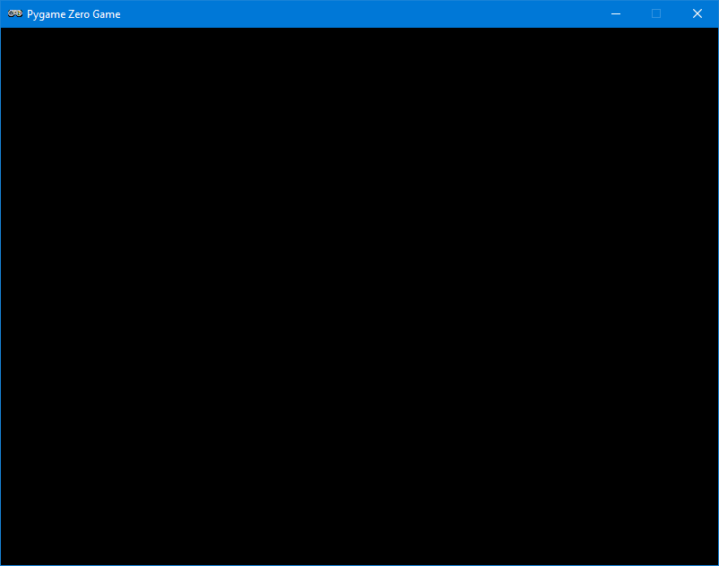
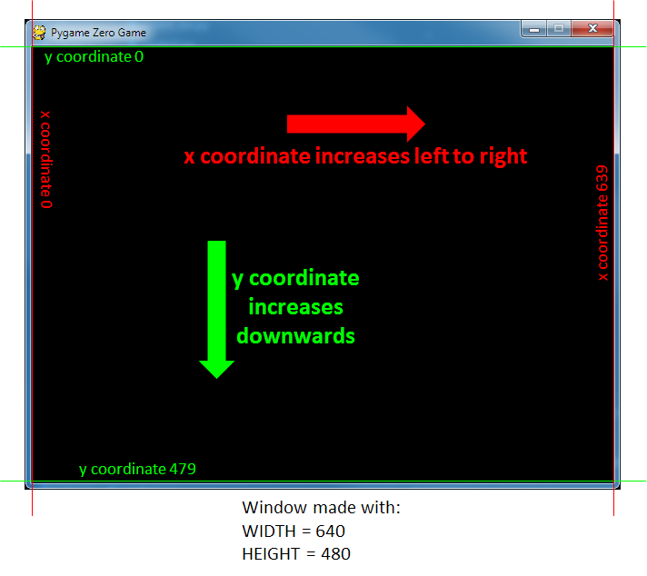
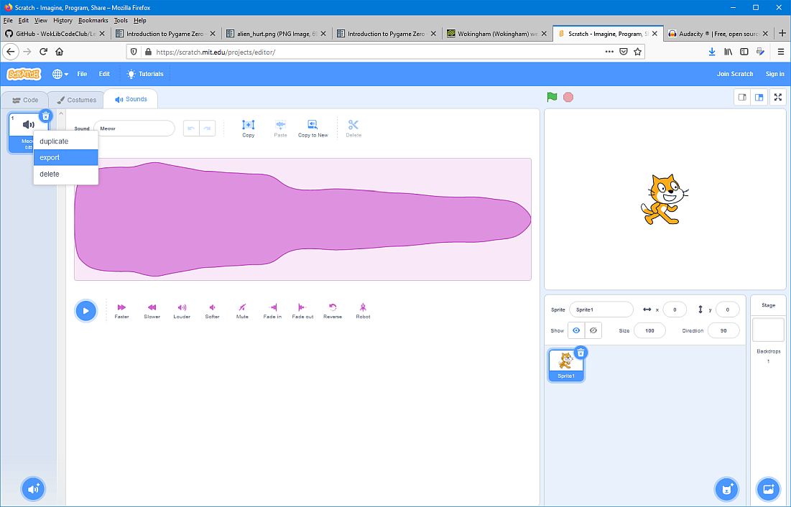

# What does Pygame Zero do to Python code?

When you run Python code using Pygame Zero there are a lot of things going on behind the scenes which you can't see. This section describes some of those things.

For more detail on any of these items please refer to the [Pygame Zero website](https://pygame-zero.readthedocs.io/en/latest/index.html).

## Pygame Zero creates a graphics window

When you run your Python code with Pygame Zero it will *always* create a graphics window. Even if your .py file is ***completely empty*** you will still get a graphics window:



By default the graphics window is 800 pixels wide by 600 pixels high and has a black background. You can change any of these things:

To change the width or height of the graphics window include in your code variables called ```WIDTH``` or ```HEIGHT``` and set these to the values you want for your window. For example:

```python
WIDTH = 640
HEIGHT = 480
```

To change the background colour include in your code lines like this

```python
def draw():
    screen.fill("darkred")
```

In this example the background colour of the screen will be set to the colour in the brackets. (The ```draw()``` function has a special purpose in Pygame Zero and is discussed on the next page.)

### Pygame Zero **coordinate system**

The graphics window comes with its own *coordinate system* but ***BEWARE*** this doesn't work exactly like the coordinate systems for Scratch or Python turtles:

The x coordinate starts at 0 at the left edge of the window and increases to the right. If your window is 640 pixels wide then the extreme right edge of the window will have an x coordinate of 639. (Remember that in Scratch or Python turtles the coordinate ```x=0``` is in the *middle* of the window.)

The y coordinate starts at 0 at the top edge of the window and increases DOWNWARDS. ***Be careful!*** This is the opposite way round to coordinate systems in Scratch, or Python turtle windows, or in normal graphs you might draw in maths. If your window is 480 pixels high then the extreme *bottom* edge of the window will have a y coordinate of 479.



### Killing the graphics window

While you are developing your projects you will find your programmes will run for ever unless you *kill* them manually. The best way to do this is to click on the cross in the top right corner of the graphics window.

If you can't get your Pygame Zero code to run it might be because you ran it before and the graphics window is still open. In this case kill the graphics window.

## Pygame Zero looks for certain folders

When you write code to run using Pygame Zero you are *strongly* advised to make a separate folder for your project.

### Use images in your code

If you then make a subfolder called ***images*** inside your project folder Pygame Zero will automatically let you use any image files in this folder in your code. Your image files must be in ```.png```, ```.gif```, or ```.jpg``` formats. PNG is recommended: it will allow high quality images with transparency.

You can have a set of images with the same prefix and an increasing number, for example

```windows
frog1.png
frog2.png
frog3.png
```

and Pygame will let you use these rather like the different *costumes* of a Scratch sprite.

### Use sounds in your code

If you make a subfolder called ***sounds*** inside your project folder Pygame Zero will automatically let you use any sound files in this folder in your code. Your sound files must be in ```.wav``` or ```.ogg``` formats (you ***can't*** use ```.mp3``` files).

For manipulating sounds there is a free piece of software called [Audacity](https://www.audacityteam.org/) which is available for all operating systems and will enable you to change the format of your sound files as well as edit them.

If you find sounds you like on the [Scratch website](https://scratch.mit.edu/projects/editor/) you can download them by clicking on the tab marked **Sounds**, then *right-clicking* on the icon for the sound at the left, then choosing **export**. You can then save the file in .wav format somewhere on your computer to use with Pygame Zero.



## Go to the next page

The [next page](what_pgz_does2.md) describes what Pygame Zero is doing behind the scenes as your code is running.