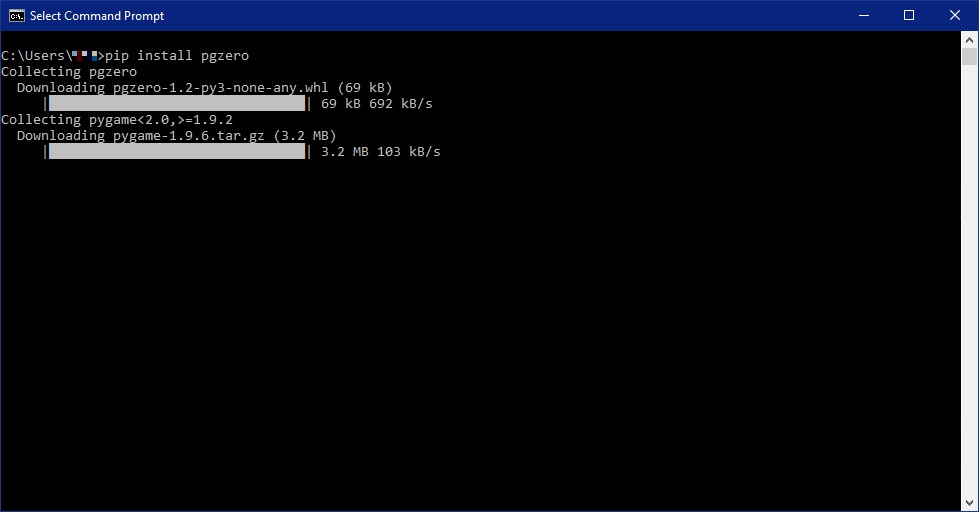

# Installing Pygame Zero on your computer

## Adding Pygame Zero to a Python installation packaged with the *mu* editor

Good news!

Pygame Zero comes ready installed with the **mu** editor so you have it installed already.

## Adding Pygame Zero to a stand-alone full Python installation

These instructions are taken from the Pygame Zero website. For the latest information check [https://pygame-zero.readthedocs.io/en/latest/installation.html](https://pygame-zero.readthedocs.io/en/latest/installation.html).

To add Pygame Zero to your Python installation you need to use a programme called ```pip```. This comes with Python, but to access it you need to open a *command prompt* in Windows, or a *terminal window* in MacOS or Linux.

### Installation for Windows

To open a *command prompt* press the Windows key then type "cmd". The command prompt should open.

Type ```pip install pgzero``` and after a while some graphics will appear showing that Pygame Zero is being downloaded:



When this finishes, and the windows shows the prompt ```C:\users\your username>``` the installation has finished.

### Installation for MacOS

To open a *Terminal window* open your Applications folder, then open Utilities and double-click on Terminal. When the terminal opens type ```pip install pgzero```.

This will install Pygame Zero.

To use Pygame Zero with MacOS it's best to have Python version 3.6 or higher installed on your computer.
