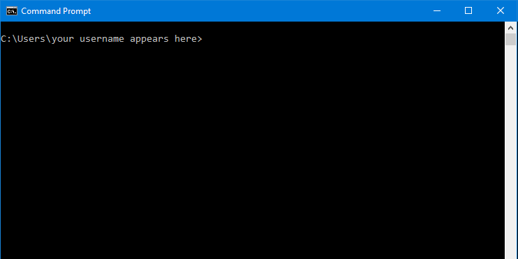
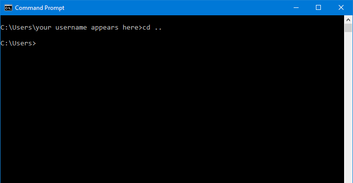

# Windows Command Window - List of commands for file system navigation

These are the basic commands for setting the directory of your Windows Command window.

When you first open the command window it will probably show the current directory as your user's home directory:



The text before the ```>``` sign shows your current directory. The part of this text before the ```:``` sign represents the current disk drive.

This prompt indicates the window is focussed on disk drive ```C:``` and a directory called ```Users``` and a *sub*-directory of ```Users``` called after your username.

### Changing the disk drive

Type the letter of the drive you want to change to followed by a colon:

```windows
E:
```

### Changing the current directory to a *higher* level directory

Type ```cd``` for "change directory" followed by two dots to change to the next level up

```windows
cd ..
```



The "prompt string" now shows you are in a higher directory.

