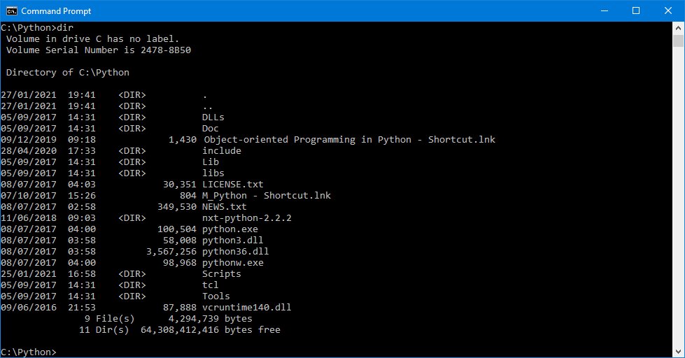
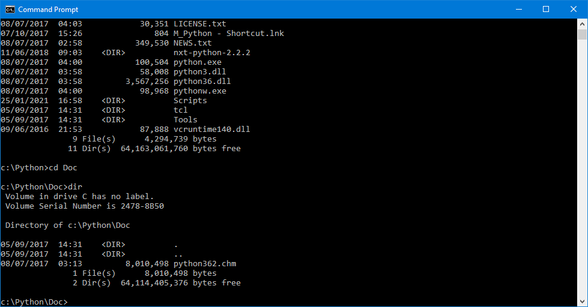

# Windows Command Window - List of commands for file system navigation

These are the basic commands for setting the directory of your Windows Command window.

When you first open the command window it will probably show the current directory as your user's home directory:


The text before the ```>``` sign shows your current directory. The part of this text before the ```:``` sign represents the current disk drive.

This prompt indicates the window is focussed on disk drive ```C:``` and a directory called ```Users``` and a *sub*-directory of ```Users``` called after your username.

### Changing the disk drive

Type the letter of the drive you want to change to followed by a colon:

```windows
E:
```

### Changing the current directory to a *higher* level directory

Type ```cd``` for "change directory" followed by two dots to change to the next level up

```windows
cd ..
```


The "prompt string" now shows you are in a higher directory.

### Using ```dir``` to list files and directories

The command ```dir``` is key to using the Command window - it will give you a list of all the files and directories in the location where your command window is currently focussed.



In the image above the window has been set to the path ```C:\Python```. The command ```dir``` shows that in this directory there are 11 sub-directories, shown by the text ```<DIR>``` and 9 files.



In the image above the focus of the window has been changed to the sub-directory ```Doc``` using the command ```cd Doc```. The command ```dir``` then shows that in this subdirectory there are two sub-directories, and one file.

Using the commands:

```windows
..
cd
dir
```

it is possible to change the focus of the window to any location on your file system.

### Link to an internet tutorial

Here is a link to a short tutorial about navigating through the file system using a Command window:

[https://riptutorial.com/cmd/example/8646/navigating-in-cmd](https://riptutorial.com/cmd/example/8646/navigating-in-cmd)