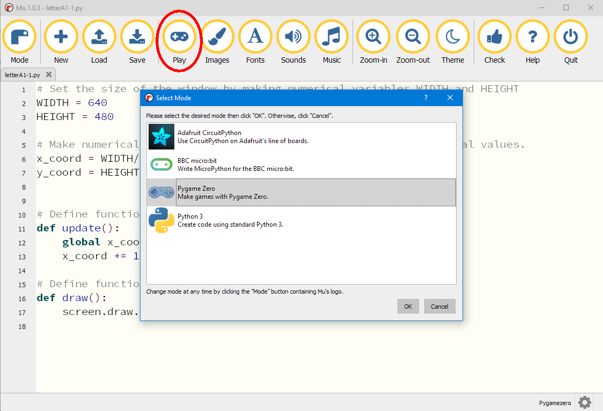
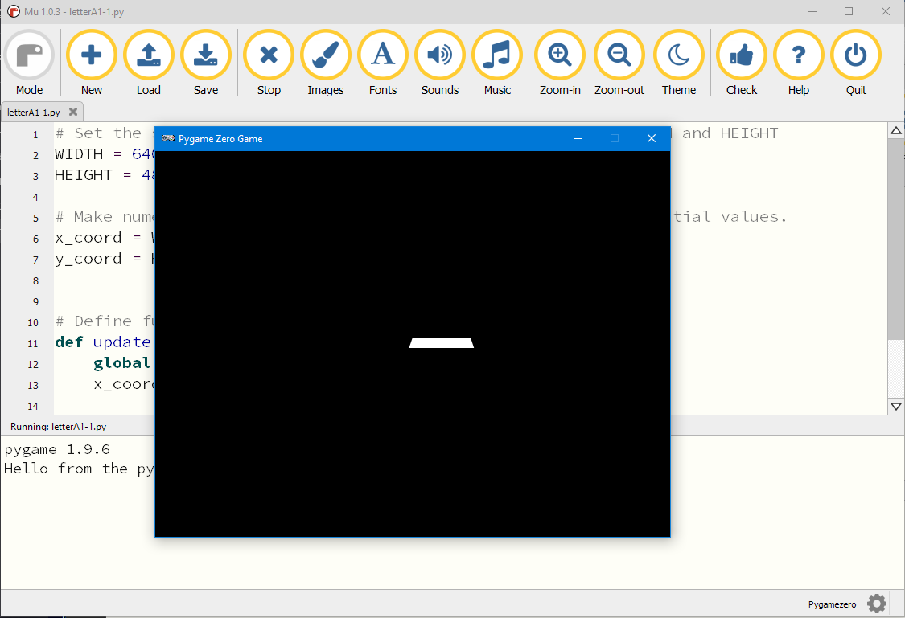
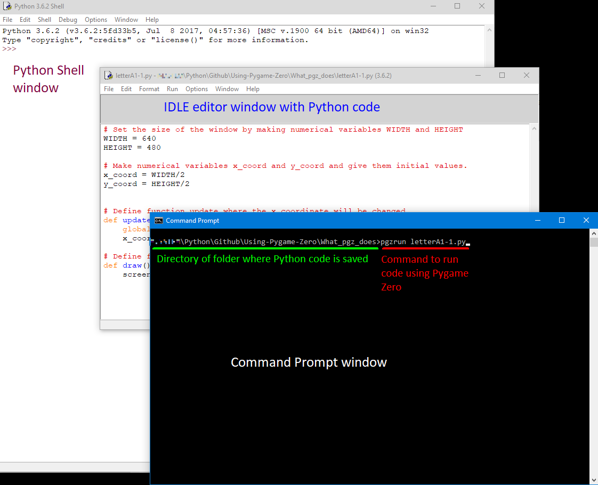

# Run your Python code using the extra features of Pygame Zero

These instructions are taken from the Pygame Zero website. For the latest information check [https://pygame-zero.readthedocs.io/en/latest/ide-mode.html](https://pygame-zero.readthedocs.io/en/latest/ide-mode.html)

## Running Pygame Zero code with the **mu** editor

This is the simplest way to run code with Pygame Zero. When you have written and saved your code in the *mu* editor window click on the ***Mode*** button at the top left and choose the option "Pygame Zero":



Click "OK" then click on the button marked *Play* to run your code. A Pygame Zero Game window will open:



To stop your code either kill the Pygame Zero window by clicking the red cross, or click the *mu* Stop button.

## Running Pygame Zero code with a full stand-alone Python installation

The method of running code with Pygame Zero has changed, so you may need to use a different procedure depending on what version of Pygame Zero you have.

### Which version of Pygame Zero have you installed?

Open a command window in Windows, or a Terminal window in MacOS (for instructions to do this refer to [installing Pygame Zero](../install_pgz/installing_pgz.md)) and type

```windows
pip freeze
```

This will generate a list of all the Python modules on your computer. Look for the line that says something like

```windows
pgzero==1.2
```

This will tell you the version you have installed.

### If you are running Pygame Zero version 1.2 or greater

You can now ```import``` the Pygame Zero library to your code and add a ```pgzrun.go()``` function which lets you run the code using Pygame Zero as if it was a normal Python programme.

As the ***first*** line in your code add

```python
import pgzrun
```

and as the ***last*** line in your code add

```python
pgzrun.go()
```

You can now run your code using Pygame Zero just by starting the code in the normal way.

### If you are running a Pygame Zero version *earlier* than 1.2

In this case you will have to fire up your Python code from a command (Windows) or Terminal (MacOS) window using the programme ```pgzrun```.

First you need to change the directory of your Command or Terminal window to the directory where your Python code is stored.

If you are using Windows [here](cmd_navigation.md) is a list of commands used in the Windows Command window for navigation around the file system.

With your Command or Terminal window set to the directory where your Python code is saved type:

```'windows
pgzrun name-of-python-code-file.py
```

where you substitute the name of your Python file in this line. This will open up the Pygame Zero Game window and your code will run.

**Keyboard shortcut**

One useful feature of the Command or Terminal window is that you can repeat your previous command simply by hitting the **UP** arrow key, then pressing Enter. If you just want to run your Python code again this is much quicker than typing the whole command again.

If you keep pressing the **UP** arrow key you can get back the history of all the commands you have typed since opening the window.

### *Running Pygame Zero code with the IDLE editor*

If you are using the IDLE editor for writing your Python code then you will have to open a separate Command or Terminal window. This will give you *three* open windows (and when the programme runs a fourth window will open):



#### Running Pygame Zero code with **Visual Studio Code**

If you are using VSC for editing your Python code you can open the Command window or Terminal window as a separate panel in VSC underneath your code:

